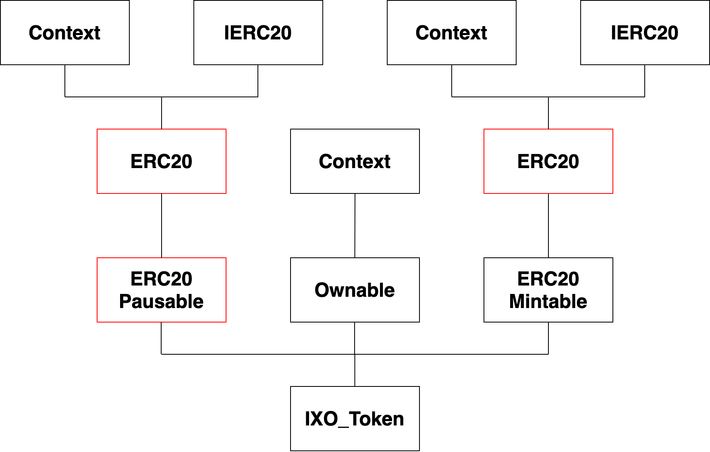
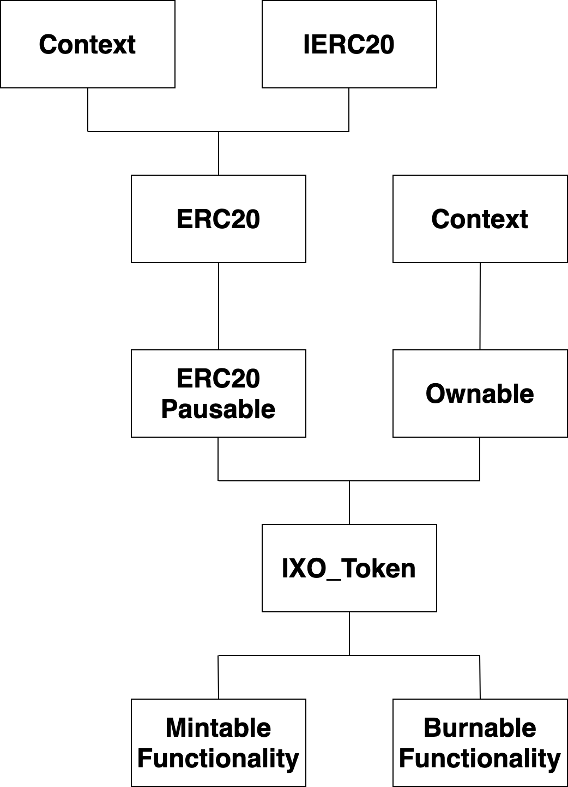

<div align="center">
    
    <h1>IXO ERC20 Token</h1>
    <h5>
        An ERC20 token created using the OpenZeppelin Contracts library. This token is extended with the following functionality: Pausable, Mintable, Burnable, SafeERC20 and Ownable. 
    </h5>
    <h6>
        These extensions are explored in detail in the Design Decisions & Inheritance section below.
    </h6>
</div>

---
# Index 

| Heading | Topic | 
|:--------|:------|
| [Repository Guide](#repository-guide) | [Getting Started](#getting-started)
| | [Testing and Coverage](#testing-and-coverage) 
| | [Deployment](#deployment) 
| [Architecture](#architecture) | [Design Decisions](#design-decisions) 
|  | [Inheritance](#inheritance) |

## Additional Documentation

### [> Admins: Permissions & Risks](./resources/admin_permissions_and_risks.md)
### [> Gnosis Safe Guide](./resources/gnosis_safe_guide.md)
### [> Wallet Best Practices](./resources/wallet_best_practices.md)
---

# Repository Guide
Below is a guide to setting up the needed environment for interacting with this repository. 

## Getting Started
To get the environment set up, you will need to install the needed packages and dependencies. You can use `yarn` or `npm` to set up these dependencies. 

Open a command line terminal and navigate to the root file of this repository.

Inside the terminal, install dependencies by running:
`yarn` or `npm install`

To compile the smart contracts run:
`yarn build` or `npm run build`

## Testing and Coverage
To run the tests you will need to create a local blockchain using Ganache. Etherlime has a convenient wrapped Ganache instance that you can use out the box. Please note that the Ganache GUI will require additional configuration to use with this repository and is not recommended.

In a terminal, run:
`yarn start` or `npm run start`

In a new terminal at the root of this repository, run:
`yarn test` or `npm run test`

This will run the tests. Note that these tests are in no way comprehensive tests of the OpenZeppelin smart contract library, but rather test that the token contract has correctly inherited all the needed functionality, and that the functionality behaves as expected. 

To run the coverage, you will first need to end the Ganache instance you are running. The coverage tool runs it's own Ganache instance and as such needs the Ganache port (8545) open. 

In a terminal run:
`yarn cover` or `npm run cover`

It may take some time to run, but you should see the following:

<div align="center">

</div>

## Deployment
A comprehensive deployment script has been written for this token. 

Below are the steps that need to be taken to deploy on one of the three supported networks (`local`, `rinkeby` & `mainnet`).
1. In the root of the directory make a file named `.env`
2. Open the file called `.env.example` and copy the contents. It should look like below:
    ```
    # Deployment private keys (insecure):
    DEPLOYER_PRIVATE_KEY_LOCAL=0x
    DEPLOYER_PRIVATE_KEY_RINKEBY=0x
    DEPLOYER_PRIVATE_KEY_MAINNET=0x

    # RPC provider keys:
    INFURA_API_KEY=

    # Deployment variables:
    TOKEN_NAME=""
    TOKEN_SYMBOL=""
    ADMIN_ADDRESS_PUBLIC=0x
    ```
3. Paste the contents into the `.env` file created in step one.
4. Add a private key for the deployer. Please note that this private key is treated as insecure in the script and as such *the deployer wallet should be different from the admin wallet*. Note that the private key needs to start with `0x`.
5. If deploying to `rinkeby` or `mainnet` you will need to provide an Infura API key. If you do not have a key, you can set one up with [Infura for free](https://infura.io/).
6. Next you will need to set up the deployment variables. Note that the token name and symbol must be encapsulated in quotation marks (as shown in the `.env.example`). The admin address must start with `0x`. 
7. Run the relevant script for the desired network in a terminal:
    `yarn deploy:local` 
    * Ensure you have an instance of Ganache running, and that the deployer wallet has Ether in the network.

    `yarn deploy:rinkeby`
    * Ensure the deployer wallet has Ether on the Rinkeby network.

    `yarn deploy:mainnet`
    * Ensure the deployer wallet has Ether on the Ethereum Mainnet. Also note that the script has a smart gas price, and is set to use the fast gas price. Depending on network congestion this may require a decent amount of Ether. 

# Architecture

## Design Decisions
OpenZeppelin V3.x uses hooks (see their [documentation here](https://docs.openzeppelin.com/contracts/3.x/extending-contracts#using-hooks)). This hook is present in the `ERC20` contract, and is overridden in the `ERC20Pausable` contract. 

This caused an issue as the token is using `ERC20Pausable` as well as `ERC20Mintable`. Both of these contracts inherit `ERC20`. The conflict then arose (irrespective of the inheritance order) with having the token inherit from pausable and mintable. 

This conflict could be fixed, but would require modifying the OpenZeppelin smart contracts, which would go against the scope for this project. 

<div align="center">

</div>

## Inheritance
Below is the final inheritance structure of the token. The mintable and burnable functionality where the easiest to move out of their own contracts and simply implement their functionality directly inside the IXO token. 

This removed the inheritance conflict discussed above, as well as making the token contract easier to read and understand. 

<div align="center">

</div>

