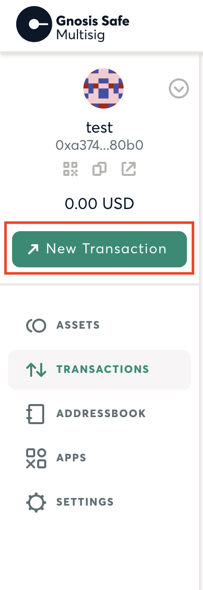
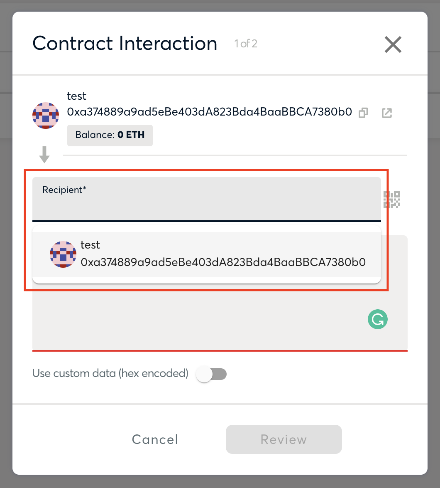
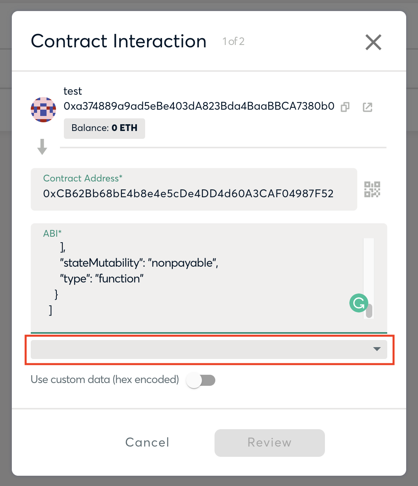
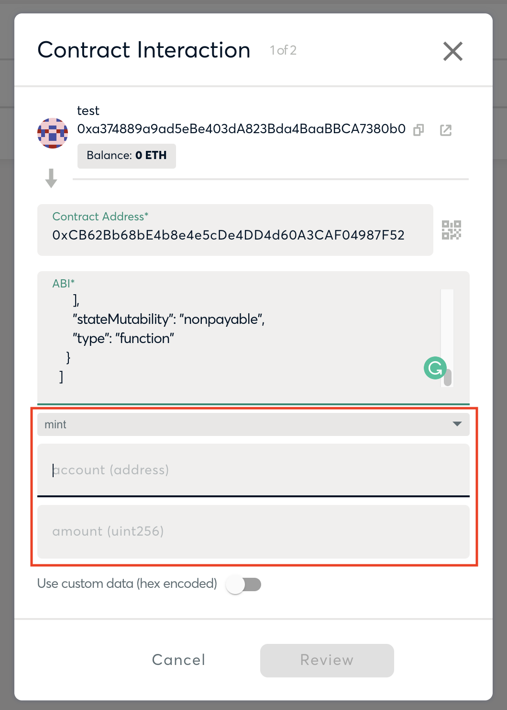

<div align="center">
    
    <h1>Gnosis Safe Guide</h1>
    <h5>
        This document outlines the use, set up and maintenance of using a Gnosis Safe multiple signature smart contract wallet.
    </h5>
    <h6>
        This document is based off of the Gnosis Safe documentation, and only covers a small but relevant section of their docs as it related to the ownership of the token contract. 
    </h6>
</div>

---
### Index 

| Heading | Topic | 
|:--------|:------|
| [Set Up](#set-up) | [Creating the Gnosis Safe multi-sig](#creating-the-gnosis-safe-multi-sig)
| | [Setting up the Gnosis Safe](#setting-up-the-gnosis-safe)
| | [Accessing the Safe](#accessing-the-safe) |
| [Interacting With a Smart Contract](#interacting-with-a-smart-contract) | [Loading the token contract](#loading-the-token-contract)
| | [Submitting a transaction](#submitting-a-transaction) |
| | [Approving transactions](#approving-transactions) |
| [Multi-Sig Management](#multi-sig-management) | [Adding and removing wallets](#adding-and-removing-wallets)

#### Additional Documentation

##### [< Back to `README`](../README.md)
##### [> Admins: Permissions & Risks](./resources/admin_permissions_and_risks.md)
##### [> Wallet Best Practices](./wallet_best_practices.md)

---

# Set Up
In order to create a Gnosis Safe one must either deploy using the [CLI tool](https://github.com/gnosis/safe-cli), through [directly deploying the contracts](https://github.com/gnosis/safe-contracts/blob/development/contracts/GnosisSafe.sol), or through the [webapp](https://gnosis-safe.io/app/#/welcome). The recommenced way is through the webapp.

## Creating the Gnosis Safe multi-sig
First the `GnosisSafe.sol` smart contract must be deployed. You can find the smart contract in the [Gnosis Safe contracts here](https://github.com/gnosis/safe-contracts/blob/development/contracts/GnosisSafe.sol).

The constructor does not require any parameters. 

## Setting up the Gnosis Safe
### Option 1: Webapp deployment
Navigate to the [Gnosis Safe webapp](https://gnosis-safe.io/app/#/welcome). Once there, follow the prompts to create a safe. 

Add the addresses of all the admins you wish to have controlling the multi-sig, along with a name for each wallet address. 

You will also need to enter the threshold, which will need to be smaller or equal to the number of admins added. 

After this set up the Gnosis Safe is ready to be used.

### Option 2: Mobile app deployment
To deploy a Gnosis safe through the [iOS app](https://apps.apple.com/us/app/gnosis-safe-multisig/id1515759131) or [Android app](https://play.google.com/store/apps/details?id=io.gnosis.safe) you can follow this [step by step guide from Gnosis](https://blog.gnosis.pm/gnosis-safe-walkthrough-create-transact-recover-488f02847de). 

The steps will follow the flow of the webapp deployment. 

## Accessing the Safe
Gnosis safe can be interacted with through the [iOS app](https://apps.apple.com/us/app/gnosis-safe-multisig/id1515759131), [Android app](https://play.google.com/store/apps/details?id=io.gnosis.safe) or the [desktop browser extension](https://chrome.google.com/webstore/detail/gnosis-safe-smart-wallet/iecodoenhaghdlpodmhooppdhjhmibde?hl=en). 

Follow the steps for the specific app to set up your account. Please note that the wallet is storied on your mobile device. The browser extension is only for interacting with the wallet on the mobile device. 

# Interacting With a Smart Contract
To interact with the token you will need to load in the ABI. All the information you will need is provided in the following documentation. 

## Loading the token contract
On the webapp select the "New Transaction" button.

<div align="center">

</div>

Next you need to add the address of the token in the recipient field. 

<div align="center">

</div>

Then in the ABI section you will need to copy paste the ABI of the token (below). 

```
[
    {
      "inputs": [
        {
          "internalType": "string",
          "name": "_name",
          "type": "string"
        },
        {
          "internalType": "string",
          "name": "_symbol",
          "type": "string"
        }
      ],
      "stateMutability": "nonpayable",
      "type": "constructor"
    },
    {
      "anonymous": false,
      "inputs": [
        {
          "indexed": true,
          "internalType": "address",
          "name": "owner",
          "type": "address"
        },
        {
          "indexed": true,
          "internalType": "address",
          "name": "spender",
          "type": "address"
        },
        {
          "indexed": false,
          "internalType": "uint256",
          "name": "value",
          "type": "uint256"
        }
      ],
      "name": "Approval",
      "type": "event"
    },
    {
      "anonymous": false,
      "inputs": [
        {
          "indexed": true,
          "internalType": "address",
          "name": "previousOwner",
          "type": "address"
        },
        {
          "indexed": true,
          "internalType": "address",
          "name": "newOwner",
          "type": "address"
        }
      ],
      "name": "OwnershipTransferred",
      "type": "event"
    },
    {
      "anonymous": false,
      "inputs": [
        {
          "indexed": false,
          "internalType": "address",
          "name": "account",
          "type": "address"
        }
      ],
      "name": "Paused",
      "type": "event"
    },
    {
      "anonymous": false,
      "inputs": [
        {
          "indexed": true,
          "internalType": "address",
          "name": "from",
          "type": "address"
        },
        {
          "indexed": true,
          "internalType": "address",
          "name": "to",
          "type": "address"
        },
        {
          "indexed": false,
          "internalType": "uint256",
          "name": "value",
          "type": "uint256"
        }
      ],
      "name": "Transfer",
      "type": "event"
    },
    {
      "anonymous": false,
      "inputs": [
        {
          "indexed": false,
          "internalType": "address",
          "name": "account",
          "type": "address"
        }
      ],
      "name": "Unpaused",
      "type": "event"
    },
    {
      "inputs": [
        {
          "internalType": "address",
          "name": "owner",
          "type": "address"
        },
        {
          "internalType": "address",
          "name": "spender",
          "type": "address"
        }
      ],
      "name": "allowance",
      "outputs": [
        {
          "internalType": "uint256",
          "name": "",
          "type": "uint256"
        }
      ],
      "stateMutability": "view",
      "type": "function"
    },
    {
      "inputs": [
        {
          "internalType": "address",
          "name": "spender",
          "type": "address"
        },
        {
          "internalType": "uint256",
          "name": "amount",
          "type": "uint256"
        }
      ],
      "name": "approve",
      "outputs": [
        {
          "internalType": "bool",
          "name": "",
          "type": "bool"
        }
      ],
      "stateMutability": "nonpayable",
      "type": "function"
    },
    {
      "inputs": [
        {
          "internalType": "address",
          "name": "account",
          "type": "address"
        }
      ],
      "name": "balanceOf",
      "outputs": [
        {
          "internalType": "uint256",
          "name": "",
          "type": "uint256"
        }
      ],
      "stateMutability": "view",
      "type": "function"
    },
    {
      "inputs": [],
      "name": "decimals",
      "outputs": [
        {
          "internalType": "uint8",
          "name": "",
          "type": "uint8"
        }
      ],
      "stateMutability": "view",
      "type": "function"
    },
    {
      "inputs": [
        {
          "internalType": "address",
          "name": "spender",
          "type": "address"
        },
        {
          "internalType": "uint256",
          "name": "subtractedValue",
          "type": "uint256"
        }
      ],
      "name": "decreaseAllowance",
      "outputs": [
        {
          "internalType": "bool",
          "name": "",
          "type": "bool"
        }
      ],
      "stateMutability": "nonpayable",
      "type": "function"
    },
    {
      "inputs": [
        {
          "internalType": "address",
          "name": "spender",
          "type": "address"
        },
        {
          "internalType": "uint256",
          "name": "addedValue",
          "type": "uint256"
        }
      ],
      "name": "increaseAllowance",
      "outputs": [
        {
          "internalType": "bool",
          "name": "",
          "type": "bool"
        }
      ],
      "stateMutability": "nonpayable",
      "type": "function"
    },
    {
      "inputs": [],
      "name": "name",
      "outputs": [
        {
          "internalType": "string",
          "name": "",
          "type": "string"
        }
      ],
      "stateMutability": "view",
      "type": "function"
    },
    {
      "inputs": [],
      "name": "owner",
      "outputs": [
        {
          "internalType": "address",
          "name": "",
          "type": "address"
        }
      ],
      "stateMutability": "view",
      "type": "function"
    },
    {
      "inputs": [],
      "name": "paused",
      "outputs": [
        {
          "internalType": "bool",
          "name": "",
          "type": "bool"
        }
      ],
      "stateMutability": "view",
      "type": "function"
    },
    {
      "inputs": [],
      "name": "renounceOwnership",
      "outputs": [],
      "stateMutability": "nonpayable",
      "type": "function"
    },
    {
      "inputs": [],
      "name": "symbol",
      "outputs": [
        {
          "internalType": "string",
          "name": "",
          "type": "string"
        }
      ],
      "stateMutability": "view",
      "type": "function"
    },
    {
      "inputs": [],
      "name": "totalSupply",
      "outputs": [
        {
          "internalType": "uint256",
          "name": "",
          "type": "uint256"
        }
      ],
      "stateMutability": "view",
      "type": "function"
    },
    {
      "inputs": [
        {
          "internalType": "address",
          "name": "recipient",
          "type": "address"
        },
        {
          "internalType": "uint256",
          "name": "amount",
          "type": "uint256"
        }
      ],
      "name": "transfer",
      "outputs": [
        {
          "internalType": "bool",
          "name": "",
          "type": "bool"
        }
      ],
      "stateMutability": "nonpayable",
      "type": "function"
    },
    {
      "inputs": [
        {
          "internalType": "address",
          "name": "sender",
          "type": "address"
        },
        {
          "internalType": "address",
          "name": "recipient",
          "type": "address"
        },
        {
          "internalType": "uint256",
          "name": "amount",
          "type": "uint256"
        }
      ],
      "name": "transferFrom",
      "outputs": [
        {
          "internalType": "bool",
          "name": "",
          "type": "bool"
        }
      ],
      "stateMutability": "nonpayable",
      "type": "function"
    },
    {
      "inputs": [
        {
          "internalType": "address",
          "name": "newOwner",
          "type": "address"
        }
      ],
      "name": "transferOwnership",
      "outputs": [],
      "stateMutability": "nonpayable",
      "type": "function"
    },
    {
      "inputs": [],
      "name": "pause",
      "outputs": [],
      "stateMutability": "nonpayable",
      "type": "function"
    },
    {
      "inputs": [],
      "name": "unpause",
      "outputs": [],
      "stateMutability": "nonpayable",
      "type": "function"
    },
    {
      "inputs": [
        {
          "internalType": "uint256",
          "name": "amount",
          "type": "uint256"
        }
      ],
      "name": "burn",
      "outputs": [],
      "stateMutability": "nonpayable",
      "type": "function"
    },
    {
      "inputs": [
        {
          "internalType": "address",
          "name": "account",
          "type": "address"
        },
        {
          "internalType": "uint256",
          "name": "amount",
          "type": "uint256"
        }
      ],
      "name": "burnFrom",
      "outputs": [],
      "stateMutability": "nonpayable",
      "type": "function"
    },
    {
      "inputs": [
        {
          "internalType": "address",
          "name": "account",
          "type": "address"
        },
        {
          "internalType": "uint256",
          "name": "amount",
          "type": "uint256"
        }
      ],
      "name": "mint",
      "outputs": [
        {
          "internalType": "bool",
          "name": "",
          "type": "bool"
        }
      ],
      "stateMutability": "nonpayable",
      "type": "function"
    }
  ]
```

## Submitting a transaction
Now that the contract is loaded up we can start interacting with it.

On the same screen you will see a drop down that will let you choose the function you wish to interact with.

<div align="center">

</div>

If you select a function that requires input parameters, boxes should appear under the drop down for each parameter. 

<div align="center">

</div>

Once you are happy with the transaction and the given parameters, click "review".

It will then take you to a review page. Double check all your parameter's, and if they are all correct click "submit".

## Approving transactions
The submitted transaction should then appear on all the admins transaction page. Enough admins will need to approve the transaction in order to reach the threshold. 

# Multi-Sig Management
To manage the admins on the multi-sig, go to the webapp and click "settings".

## Adding and removing wallets
Once inside the settings select the "Owners" tab. There you will see a list of all the owners of the safe. 

In the corner there will be a button for adding an admin. This transaction will be subject to the same approve process outlined in the [approving transactions](#approving-transactions) section.

To remove an admin click on that admins address, then click "remove". Note that if removing an address will take the number of admins below the threshold, you will only be able to "replace admin" rather than remove. This transaction will also be subject to the same [approving transactions](#approving-transactions) process.